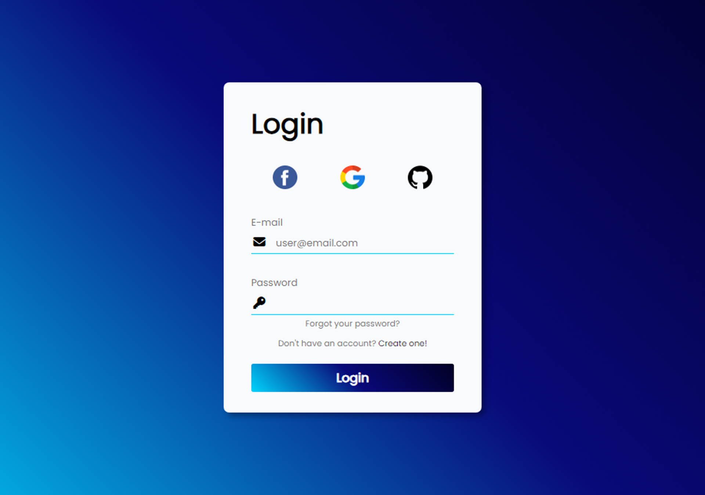

<h1 align="center">  Projeto Semanal:  🔠Formulário de Login ğŸ”</h1>

O projeto "Formulário de Login" é uma iniciativa no âmbito do meu compromisso pessoal de desenvolver novos projetos a cada semana, com o objetivo de aprimorar minhas habilidades em desenvolvimento web.
 

O foco deste projeto é criar um formulário de login intuitivo e funcional para permitir que os usuários acessem uma aplicação ou site de forma segura e conveniente. A interface será projetada de forma responsiva, garantindo uma experiência consistente em diferentes dispositivos. 

  <a href="#-tecnologias">Tecnologias</a>&nbsp;&nbsp;&nbsp;|&nbsp;&nbsp;&nbsp;
  <a href="#-projeto">Projeto</a>&nbsp;&nbsp;&nbsp;|&nbsp;&nbsp;&nbsp;
  <a href="#-layout">Layout</a>&nbsp;&nbsp;&nbsp;|&nbsp;&nbsp;&nbsp;

 

  

## 🚀 Tecnologias

Esse projeto foi desenvolvido com as seguintes tecnologias:

- HTML e CSS
- JavaScript
- Git e Github

## 💻 Projeto

Formulário de login intuitivo e funcional para permitir que os usuários acessem uma aplicação ou site de forma segura e conveniente

- [Em andamento](https://lipefhs.github.io/Login-Form/)

## 🔖 Layout

Layout inspirado no formulario criado [nesse video](https://www.youtube.com/watch?v=qKWApkuhNu8) que utilizei para estudo e auxilio na minha criação.

---

Feito com ♥ by Fellipe :wave: 